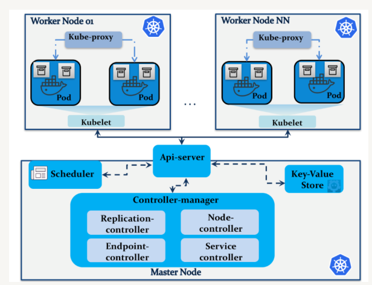

# Kubernetes notes

## Key components
**Cluster**: A set of nodes.
**Node**: A worker machine (VM or physical machine).
**Pod**: A group of one or more containers with a shared storage/network with a spec on how to run them.

## Network
**ClusterIP**: The IP address assgined to a Service.
**PodIP**: The IP address assigned to a given Pod. This is ephemeral (very short-lived).
**NodeIP**: The IP address assigned to a given node.